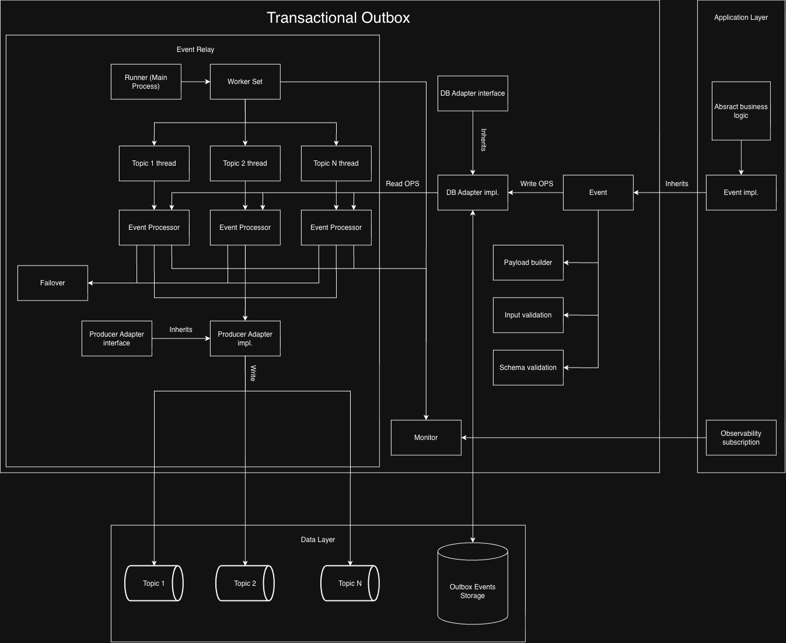

# Introduction

`transactional_outbox` is a thread-safe implementation of the transactional outbox patter. There are both an event creation and an event relay functionality. **It doesn't require Rails.**

## Requirements

`ruby >= 3.2`

## Installation

Add this line to your application's Gemfile:

```ruby
gem 'transactional_outbox'
```

And then execute:

    $ bundle install

Or install it yourself as:

    $ gem install transactional_outbox

## Architecture



## Documentation

[Documentation](docs/contents.md)

## Contributing

Bug reports and pull requests are welcome [here](https://github.com/sigmen/transactional_outbox). This project is intended to be a safe, welcoming space for collaboration, and contributors are expected to adhere to the [code of conduct](https://github.com/sigmen/transactional_outbox/blob/main/CODE_OF_CONDUCT.md).

## License

The gem is available as open source under the terms of the [MIT License](https://opensource.org/licenses/MIT).

## Code of Conduct

Everyone interacting in the TransactionalOutbox project's codebases, issue trackers, chat rooms and mailing lists is expected to follow the [code of conduct](https://github.com/sigmen/transactional_outbox/blob/main/CODE_OF_CONDUCT.md).
